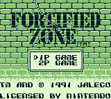
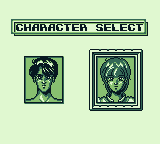
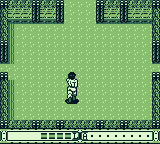
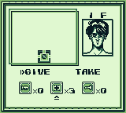

# Fortified Zone / Ikari no Yousai Rebalancing mod

Fortified Zone (also known as Ikari no Yousai in Japan) is a top-down shooter game for the Game Boy. 
Its multiplayer mode is quite interesting because both players play cooperatively in the same map, exploring the area and trading items. This proposal is a unique experience in the Game Boy catalogue and fun.

Unfortunately, multiplayer mode does not allow passwords, so the game must be played in one sitting. It's not too long, but it's hard without continues. 
This patch increases initial health for both players and gives you some medicines to start with, making the multiplayer experience much more enjoyable.

